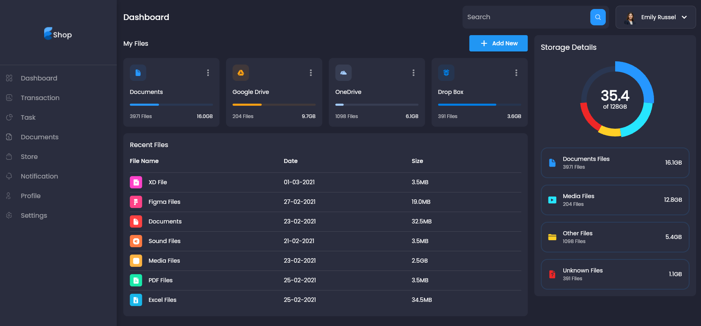
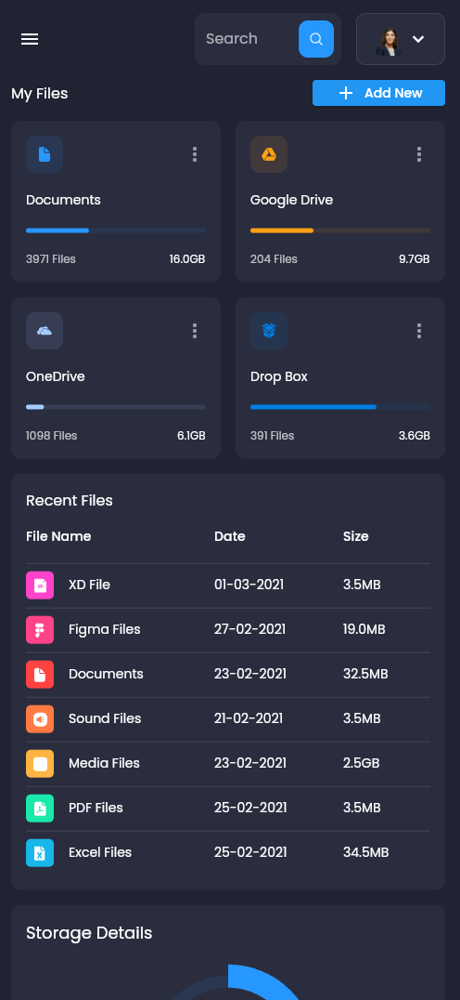

# Flutter Admin Panel

    
    

This program is to test flutter and dart, testing out a basic admin panel for mobile, tablet & desktop devices.

This has been built into a web application accessible here: https://sommos.github.io/flutter_admin_panel/

# Contribution 

If you'd like to contribute to `flutter_admin_panel` please submit a pull-request on a feature branch.

# Installing

Clone the repo:

    git clone https://github.com/Sommos/flutter_admin_panel
    cd flutter_admin_panel